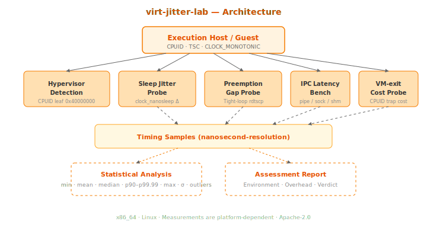

# virt-jitter-lab

**Virtualization timing and IPC latency measurement harness.**

Detect, measure, and characterize hypervisor overhead on Linux systems. Answers the question: *"How much timing jitter does virtualization add to my real-time workload?"*

## What This Is

A diagnostic toolkit that produces a comprehensive virtualization assessment:

- **Hypervisor detection** — CPUID-based identification (Hyper-V, KVM, VMware, Xen, etc.)
- **Timer jitter analysis** — measures sleep overshoot to quantify scheduling noise
- **Preemption gap detection** — tight-loop TSC sampling reveals hypervisor steal time
- **IPC latency benchmarks** — pipe, Unix socket, shared memory round-trip latency
- **VM exit cost profiling** — measures CPUID instruction cost (~477ns on Hyper-V vs ~20ns bare-metal)
- **Statistical reporting** — min, mean, median, p90-p99.99, max, σ, outlier count

## What This Is NOT

- Not a hypervisor or virtualization layer
- Not a real-time scheduler or partitioning system
- Not certification tooling (it's an engineering measurement tool)
- Not a security scanner

This tool helps engineers understand the timing cost of running safety-critical workloads in virtualized environments.

## Quick Start

```bash
# Build
cmake -B build -DCMAKE_BUILD_TYPE=Release -DVJL_BUILD_BENCH=ON
cmake --build build -j$(nproc)

# Run full assessment (default: 10K samples, 100μs sleep)
./build/virt-jitter-lab

# Custom parameters
./build/virt-jitter-lab --samples 50000 --sleep-us 500 --cpu 2

# Run VM exit benchmark
./build/bench_vmexit

# Run tests
cd build && ctest --output-on-failure
```

## Sample Output (Azure VM, Hyper-V)

```
╔══════════════════════════════════════════════╗
║     virt-jitter-lab Assessment Report        ║
╚══════════════════════════════════════════════╝

Environment:
  Virtualized:  YES
  Hypervisor:   Microsoft Hv
  CPU:          Intel(R) Xeon(R) Platinum 8370C CPU @ 2.80GHz
  Cores:        32
  TSC freq:     2.79 GHz
  Invariant TSC: yes

── Timer Jitter (sleep-based) ──
  Min:        25,410 ns    Mean: 58,656 ns (σ=1,041)
  p99:        59,723 ns    Max:  69,974 ns

── VM Exit Cost (cpuid) ──
  Min:        471 ns       Mean: 477 ns (σ=156)
  p99:        490 ns       Max:  8,608 ns

  Assessment: VIRTUALIZED environment detected.
  Hypervisor overhead is present in all measurements.
```

## What It Measures

### 1. Timer Jitter
Repeatedly calls `clock_nanosleep(CLOCK_MONOTONIC)` for a target interval (e.g., 100μs), measures the actual elapsed time, and records the overshoot. On bare metal, overshoot is typically <5μs. On a hypervisor, it reveals scheduling/steal-time noise.

### 2. Scheduling Preemption
Tight loop with consecutive `rdtscp` reads. Most gaps are <200ns (just the instruction cost). Spikes reveal where the hypervisor or host OS preempted the guest — critical data for understanding worst-case behavior.

### 3. IPC Latency
Measures round-trip time for three IPC mechanisms:
- **Pipe** — kernel-mediated, context switch on each message
- **Unix socket** — similar path, slightly different overhead
- **Shared memory + futex** — minimal kernel involvement

Comparing these across bare-metal vs. virtualized reveals how much the hypervisor adds to inter-process communication costs.

### 4. VM Exit Cost
Executes instructions that unconditionally cause VM exits (CPUID is the canonical example). On bare metal, CPUID costs ~20-30ns. On a hypervisor, it costs ~400-1000ns — the difference is pure hypervisor trap-and-emulate overhead.

## Architecture



```
┌────────────────────────────────────────────────┐
│  virt-jitter-lab                               │
│  ┌──────────────┐ ┌──────────────────────────┐ │
│  │ CPUID Detect  │ │ Timer (CLOCK_MONOTONIC + │ │
│  │ • hypervisor  │ │ rdtsc/rdtscp calibration)│ │
│  │ • inv. TSC    │ └────────────┬─────────────┘ │
│  │ • CPU brand   │              ▼               │
│  └──────┬───────┘  ┌──────────────────────────┐ │
│         ▼          │ Jitter Sampler            │ │
│  ┌──────────────┐  │ • Sleep jitter            │ │
│  │ VM Exit Probe│  │ • Preemption detection    │ │
│  │ • CPUID cost │  └────────────┬─────────────┘ │
│  │ • clock_get  │              ▼               │
│  └──────┬───────┘  ┌──────────────────────────┐ │
│         ▼          │ IPC Bench                 │ │
│  ┌──────────────┐  │ • pipe / socket / shm     │ │
│  │ Statistics   │  │ • fork + ping-pong        │ │
│  │ • percentiles│  └────────────┬─────────────┘ │
│  │ • histogram  │              ▼               │
│  │ • outliers   │  ┌──────────────────────────┐ │
│  └──────┬───────┘  │ Report Generator         │ │
│         └─────────►│ • Environment summary    │ │
│                    │ • All results + verdict   │ │
│                    └──────────────────────────┘ │
└────────────────────────────────────────────────┘
```

## Building

**Requirements:** Linux (x86_64), CMake ≥ 3.25, GCC ≥ 13 or Clang ≥ 17

```bash
cmake -B build -DCMAKE_BUILD_TYPE=Release -DVJL_BUILD_TESTS=ON -DVJL_BUILD_BENCH=ON
cmake --build build -j$(nproc)
cd build && ctest --output-on-failure
```

## Companion Repos

- **[partition-guard](https://github.com/yablokolabs/partition-guard)** — Time/space partitioning for mixed-criticality workloads
- **[wcet-probe](https://github.com/yablokolabs/wcet-probe)** — Measurement-based WCET analysis toolkit
- **[detframe](https://github.com/yablokolabs/detframe)** — Deterministic rendering pipeline for avionics displays

Together: **isolate → validate → characterize → render**

## Limitations

1. **x86_64 only** — uses rdtsc/rdtscp and CPUID (ARM port would need cntvct_el0)
2. **Linux only** — uses clock_nanosleep, sched_setaffinity, futex
3. **Not a real-time benchmark** — measures from within the guest; doesn't measure host-side overhead
4. **No IOMMU/SR-IOV analysis** — focuses on CPU timing, not I/O virtualization
5. **Statistical, not formal** — provides measurement data, not mathematical guarantees

## References

- Intel SDM Vol. 3C — VMX Operations and VM Exits
- KVM Performance Tuning (kernel.org)
- Abeni & Buttazzo — Resource Reservation in Real-Time Systems
- Cucu-Grosjean et al. — Measurement-Based Probabilistic Timing Analysis

## License

Apache-2.0
